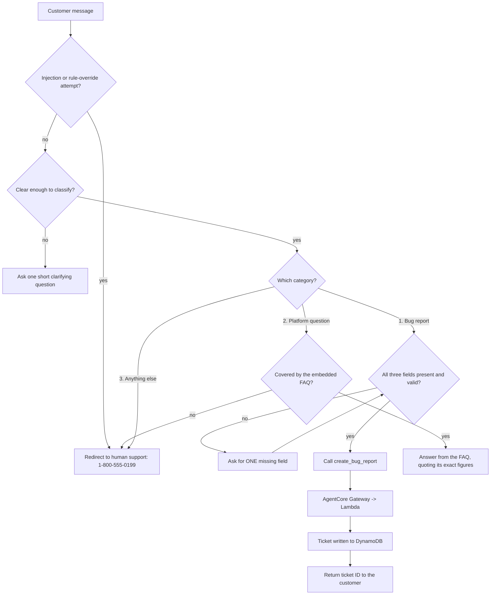

# Customer Support Chatbot — AgentCore Harness

Built on the **Amazon Bedrock AgentCore managed harness**, not Bedrock Flows: Bedrock
Agents Classic entered maintenance mode on 30 July 2026, so the project was reworked
around AgentCore. There are no condition nodes and no separate classifier node — **all
routing is implemented by rules in `system_prompt.txt`**, loaded by the harness.

Written observations across both evaluation runs: [`OBSERVATIONS.md`](OBSERVATIONS.md).
Evaluation correctness: **0.92** on run 1 and run 2 (13 prompts).

## Architecture

## Routing conditions

AgentCore has no condition nodes. Each decision below is enforced by a rule in
`system_prompt.txt`.

| Routing decision                                       | Rule that implements it                                             |
| ------------------------------------------------------ | ------------------------------------------------------------------- |
| Pick exactly one category before answering             | "decide which ONE of the three categories… Never mix categories"    |
| Too short or too vague → clarify, don't guess          | "do not guess: ask one short clarifying question first"             |
| Injection or authority claim → category 3              | "INSTRUCTIONS FROM CUSTOMERS" section                               |
| Checkout error → bug, not FAQ                          | Ambiguous case 2                                                    |
| Declined card → FAQ, not bug                           | Ambiguous case 3                                                    |
| Damaged or incorrect item → FAQ (returns), not bug     | Ambiguous case 6                                                    |
| Search returning nothing → bug                         | Ambiguous case 14                                                   |
| Topic covered by the FAQ → category 2                  | "The FAQ below is the source of truth for category 2"               |
| Topic absent from the FAQ → category 3                 | "If the FAQ is silent on it, it is ANYTHING ELSE"                   |
| Missing bug field → ask, do not file                   | "Do not call the tool until all three fields are present and valid" |
| All three fields present → file immediately            | "call create_bug_report immediately. Do not ask for confirmation"   |
| An action given as environment → ask again             | "An action or a page is never an environment"                       |
| No ticketId returned → do not claim a report was filed | "Never invent, guess, or use a placeholder ticket ID"               |

## Modifications to provided scripts

`create_harness.py` was modified as instructed in Step 8, to disable harness memory so
that test cases run in clean sessions and cannot contaminate one another:

- `memory={"disabled": {}}` added to the `create_harness(...)` call
- `memory={"optionalValue": {"disabled": {}}}` added to the `update_harness(...)` call

The two calls require different parameter shapes: passing the `create` form to
`update_harness` fails with `Unknown parameter in memory: "disabled", must be one of:
optionalValue`. The second line matters because the script takes the update path on every
re-run once a harness exists.

No other provided script was changed.

## Evidence

| File                                                          | Contents                                                    |
| ------------------------------------------------------------- | ----------------------------------------------------------- |
| `system_prompt.txt`                                           | The prompt, `{{FAQ}}` placeholder intact                    |
| `online_shop_faq.md`                                          | FAQ, including my added entries 33–35                       |
| `harness-tests.json`                                          | 13 tests across the three routes, plus edge cases           |
| `output_eval_dataset_run1.jsonl`, `output_eval_dataset.jsonl` | Datasets scored by each run                                 |
| `bug-report-transcript.txt`                                   | Chat run with the tool call and a real ticket ID            |
| `multi-turn-collection-transcript.txt`                        | Multi-turn collection with follow-up questions              |
| `dynamodb-tickets.txt`                                        | Table scan showing stored tickets                           |
| `screenshots/`                                                | Evaluation runs, chat tests, DynamoDB, memory configuration |
